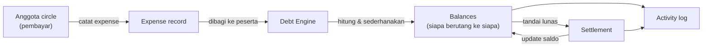

<div align="center">
  <h1>SplitCircle</h1>
  <p>Patungan dan utang circle pertemanan, beres dalam satu tempat.</p>

  
  
  
  
  
</div>

---

SplitCircle adalah aplikasi pencatat pengeluaran dan utang-piutang untuk
circle pertemanan: nongkrong bareng, trip liburan, kontrakan patungan, atau
langganan yang dibayar bergantian. Setiap pengeluaran yang dicatat langsung
dipecah ke anggota yang ikut menanggung, dan mesin saldo menghitung siapa
berutang ke siapa dengan jumlah transaksi pelunasan seminimal mungkin —
bukan lagi hitung-hitungan manual di chat grup.

## How it works



Setiap expense dicatat dengan pembayar dan daftar peserta yang menanggung.
Debt Engine menjumlahkan seluruh expense di dalam sebuah circle lalu
menyederhanakan graf utang antar anggota menjadi jumlah transfer paling
sedikit yang dibutuhkan untuk melunasi semuanya. Saat sebuah utang
diselesaikan lewat Settlement, saldo diperbarui dan tercatat di Activity
log sehingga seluruh anggota circle punya riwayat yang bisa diaudit.

## Repository layout

- `src/app/(auth)` - halaman login & register
- `src/app/(dashboard)` - halaman utama setelah login (circle, expenses, balances)
- `src/app/api` - API routes
- `src/components/expenses` - form & tampilan pencatatan pengeluaran
- `src/components/balances` - tampilan saldo per anggota
- `src/components/settlements` - alur penyelesaian/pelunasan utang
- `src/components/activity` - log aktivitas circle
- `src/components/ui` - komponen dasar (shadcn/ui)
- `src/lib/debtEngine.ts` - logika kalkulasi & penyederhanaan utang
- `src/lib/schema.ts` - skema database (Drizzle ORM)
- `src/lib/auth.ts`, `src/lib/session.ts` - autentikasi & manajemen sesi
- `src/middleware.ts` - proteksi route
- `drizzle/` - migrasi database

## Running locally

```bash
git clone https://github.com/fijamushofaini77/splitcircle.git
cd splitcircle
npm install
cp .env.example .env   # isi kredensial database & auth secret
npx drizzle-kit push   # sinkronkan skema ke database
npm run dev
```

Buka [http://localhost:3000](http://localhost:3000).

## Trying the app

1. Buka halaman `/register` dan buat akun baru.
2. Buat circle baru atau gabung ke circle yang sudah ada lewat undangan.
3. Catat expense pertama: pilih siapa yang membayar dan siapa saja yang menanggung.
4. Buka halaman Balances untuk melihat saldo utang-piutang yang sudah disederhanakan Debt Engine.
5. Tandai sebuah utang sebagai lunas di halaman Settlements, lalu cek perubahannya di Activity log.

## Design notes

- Debt Engine memisahkan pencatatan expense mentah dari kalkulasi saldo,
  sehingga histori transaksi tetap utuh meski aturan penyederhanaan utang
  berubah di kemudian hari.
- Autentikasi & proteksi route ditangani di level `middleware.ts`, bukan
  per-halaman, supaya konsisten di seluruh route group `(dashboard)`.
- Skema database didefinisikan lewat Drizzle ORM (`src/lib/schema.ts`)
  agar migrasi terlacak dan bisa direplay, bukan diubah manual di database.
- Validasi input dipisahkan ke `src/lib/validators.ts` supaya aturan yang
  sama bisa dipakai baik di form client maupun di API route.

## Roadmap

- [ ] Notifikasi pengingat utang via email/WhatsApp
- [ ] Export laporan pengeluaran circle (PDF/CSV)
- [ ] Split pengeluaran dengan porsi kustom, bukan hanya rata
- [ ] Dukungan multi-currency
- [ ] Integrasi payment gateway lokal untuk pelunasan langsung