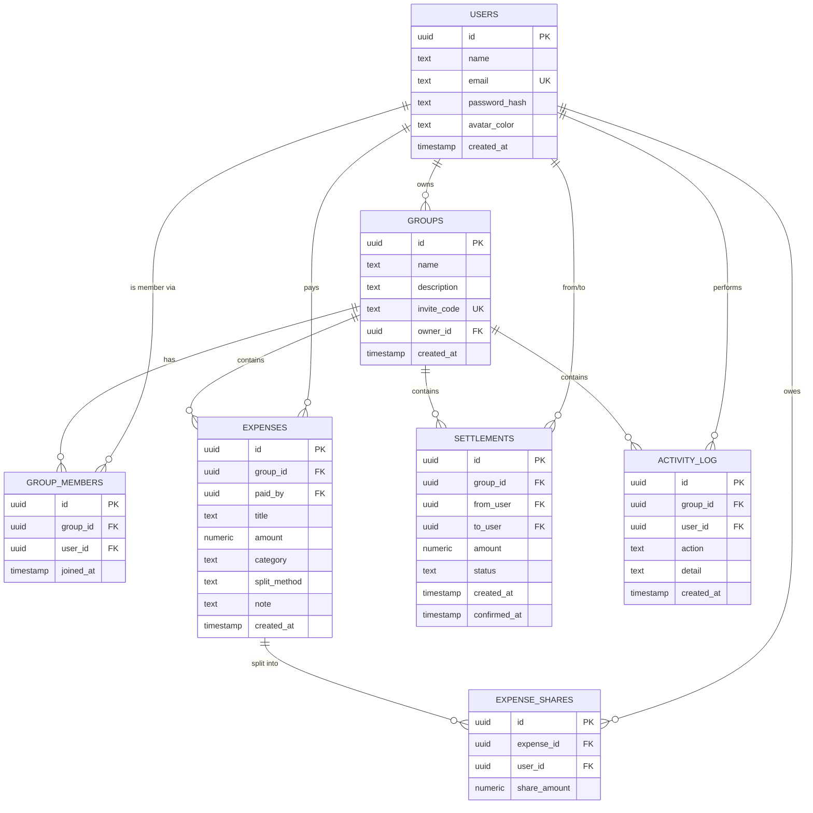

# PRD — SplitCircle

## 1. Project Overview

**Nama Aplikasi:** SplitCircle — Split Bill & Utang Circle

**Latar Belakang Masalah:**
Circle pertemanan — kos bareng, trip liburan, langganan streaming
patungan, atau sekadar nongkrong — hampir selalu berakhir dengan
pencatatan manual: chat WhatsApp penuh nominal, atau spreadsheet yang
lupa di-update. Dua masalah yang muncul berulang:

1. **Menghitung siapa berutang ke siapa jadi rumit** begitu jumlah
   transaksi bertambah — satu orang bisa berutang ke beberapa orang
   sekaligus untuk pengeluaran berbeda-beda, padahal secara matematis
   utang itu bisa disederhanakan jadi lebih sedikit transfer.
2. **Tidak ada riwayat yang bisa diaudit** — kalau ada perselisihan
   ("aku udah bayar kok"), tidak ada satu sumber kebenaran yang semua
   anggota grup percaya.

SplitCircle menyelesaikan dua masalah ini dengan pencatatan expense
terstruktur per anggota, mesin penyederhanaan utang otomatis (debt
engine), dan alur konfirmasi pembayaran dua arah yang tercatat di
activity log.

**Target Pengguna:**

| Persona | Kebutuhan utama |
| --- | --- |
| Anak kos / kontrakan bareng | Bagi tagihan listrik/air/wifi/belanja bulanan secara rata tanpa hitung manual tiap bulan. |
| Grup trip/liburan | Banyak pengeluaran dalam waktu singkat, dibayar bergantian oleh anggota berbeda, butuh rekap saldo cepat di akhir trip. |
| Circle langganan bareng (streaming, cloud storage, dll) | Pengeluaran rutin dengan pembagian tetap, butuh riwayat siapa sudah/belum bayar bulan ini. |

Ketiga persona ini adalah grup kecil (biasanya 2–10 orang) yang saling
kenal — jadi tidak butuh sistem reputasi/rating, dan transaksi uang
sungguhan tetap terjadi di luar aplikasi (transfer bank/e-wallet manual).

## 2. User Personas & User Flow

**Aktor:**
SplitCircle **tidak punya role Admin/User terpisah**. Semua pengguna
terautentikasi punya hak yang sama (single actor: **Member**), dengan
satu pembeda kontekstual: **Group Owner** (pembuat grup) — tapi owner
tidak punya hak istimewa di luar menjadi anggota pertama grup tersebut.
Batasan aksi yang ada murni berbasis kepemilikan data, bukan role:
- Hanya pembayar sebuah expense yang boleh menghapus expense itu.
- Hanya penerima sebuah settlement yang boleh confirm/reject-nya.

| Aktor | Deskripsi |
| --- | --- |
| **Member** (semua pengguna terautentikasi) | Bisa membuat/gabung grup, mencatat expense, melihat balances, mengajukan & merespons settlement, melihat activity log. |

**User Flow — alur pemakaian utama:**

1. Pengguna baru membuka `/register`, mengisi nama/email/password →
   akun dibuat, sesi login otomatis aktif.
2. Pengguna diarahkan ke dashboard (`/`) → membuat grup baru (isi
   nama & deskripsi) **atau** bergabung ke grup existing lewat kode
   undangan 6 karakter dari anggota lain.
3. Di dalam halaman grup (`/groups/[groupId]`), pengguna mencatat
   expense: judul, nominal, kategori, metode split (rata/custom/
   persentase), lalu submit.
4. Pengguna membuka tab **Balances** untuk melihat saldo bersihnya
   dan saran transfer minimum yang dihasilkan debt engine.
5. Jika pengguna berutang, ia mengajukan **Settlement** ke anggota
   yang berhak menerima, dengan nominal sesuai saran (atau manual).
6. Anggota penerima settlement membuka tab **Settlements**, lalu
   **Confirm** (saldo diperbarui) atau **Reject** (perlu klarifikasi
   ulang di luar aplikasi).
7. Pengguna dapat membuka tab **Activity** kapan saja untuk menelusuri
   seluruh riwayat perubahan di grup tersebut.
8. Pengguna dapat mengekspor seluruh expense grup sebagai CSV dari
   halaman grup.

## 3. Functional Requirements

| ID Fitur | Nama Fitur | Deskripsi Perilaku | Status |
| --- | --- | --- | --- |
| FR-01 | Register | Pengguna membuat akun baru dengan nama, email, password (≥6 karakter). Email harus unik. Password di-hash sebelum disimpan. Sesi login langsung aktif setelah berhasil. | Wajib |
| FR-02 | Login | Pengguna masuk dengan email & password yang cocok. Sistem menerbitkan sesi JWT di httpOnly cookie. | Wajib |
| FR-03 | Logout | Pengguna mengakhiri sesi aktif; cookie sesi dihapus. | Wajib |
| FR-04 | Proteksi Route | Seluruh halaman privat menolak akses tanpa sesi valid dan mengarahkan ke `/login`. | Wajib |
| FR-05 | Buat Grup | Pengguna membuat grup baru (nama + deskripsi opsional). Pembuat otomatis jadi owner & anggota pertama. Sistem menerbitkan kode undangan unik 6 karakter. | Wajib |
| FR-06 | Gabung Grup via Kode | Pengguna memasukkan kode undangan valid untuk bergabung ke grup, jika belum jadi anggota. | Wajib |
| FR-07 | Catat Expense | Anggota mencatat pengeluaran (judul, nominal, kategori, catatan opsional) dengan dirinya sebagai pembayar. | Wajib |
| FR-08 | Split Rata | Nominal expense dibagi sama besar ke seluruh anggota grup saat itu (sisa pembulatan ke anggota terakhir). | Wajib |
| FR-09 | Split Custom | Nominal per anggota diinput manual; sistem menolak jika total tidak sama dengan nominal expense. | Wajib |
| FR-10 | Split Persentase | Persentase per anggota diinput manual; sistem menolak jika total tidak 100%. | Wajib |
| FR-11 | Hapus Expense | Hanya pembayar expense yang boleh menghapusnya; share terkait ikut terhapus. | Wajib |
| FR-12 | Lihat Balances | Sistem menghitung saldo bersih tiap anggota dari seluruh expense + settlement *confirmed* di grup tersebut. | Wajib |
| FR-13 | Saran Pelunasan (Debt Engine) | Sistem menghasilkan daftar transfer minimum (from, to, amount) dari saldo bersih memakai algoritma greedy debt-simplification. | Wajib |
| FR-14 | Ajukan Settlement | Anggota yang berutang mengajukan pembayaran ke anggota tertentu dengan nominal tertentu; status awal *pending*. | Wajib |
| FR-15 | Konfirmasi/Tolak Settlement | Hanya penerima settlement yang boleh mengubah status jadi *confirmed* (saldo diperbarui) atau *rejected*. | Wajib |
| FR-16 | Activity Log | Setiap aksi penting (grup dibuat, anggota gabung, expense ditambah/dihapus, settlement diajukan/dikonfirmasi/ditolak) tercatat otomatis, ditampilkan terurut terbaru (maks. 50 entri). | Wajib |
| FR-17 | Dashboard Ringkasan | Menampilkan agregat: total grup, total pengeluaran, jumlah transaksi, jumlah settlement masuk yang pending — lintas semua grup pengguna. | Opsional |
| FR-18 | Export CSV | Mengunduh seluruh expense sebuah grup sebagai file CSV. | Opsional |

## 4. Non-Functional Requirements

**Teknologi yang digunakan (stack):**

| Layer | Pilihan |
| --- | --- |
| Framework | Next.js 16 (App Router) |
| Bahasa | TypeScript (strict) |
| Database | Neon Postgres (serverless, driver HTTP `@neondatabase/serverless`) |
| ORM | Drizzle ORM + Drizzle Kit |
| Auth | JWT (`jose`) di httpOnly cookie, hashing password `bcryptjs`, validasi input `zod` |
| Styling & UI | Tailwind CSS v4, shadcn/ui, font Poppins, ikon Iconify (`solar`) + `lucide-react` |

**Ketentuan keamanan:**

| Aspek | Ketentuan | Status |
| --- | --- | --- |
| Enkripsi password | Password di-hash dengan bcrypt (bukan disimpan plain text) | ✅ Terpenuhi |
| Sesi | JWT httpOnly cookie, `sameSite=lax`, `secure` di production, expiry 7 hari | ✅ Terpenuhi |
| Otorisasi | Setiap endpoint grup memverifikasi keanggotaan sebelum baca/tulis data; aksi hapus/confirm dibatasi ke pemilik data | ✅ Terpenuhi |
| Validasi input | Skema Zod untuk payload | ⚠️ Baru menutup register/login; expenses/groups/settlements masih validasi manual di route handler |
| Proteksi route | Middleware terpusat, bukan per-halaman | ✅ Terpenuhi |
| Rate limiting | Pembatasan percobaan login/register untuk cegah brute-force | ❌ Belum ada |
| Data integrity | Foreign key + `ON DELETE CASCADE` di skema; total split custom/persentase divalidasi | ✅ Terpenuhi |

**Ketentuan performa & keandalan:**

| Aspek | Ketentuan | Status |
| --- | --- | --- |
| Perhitungan balances | Dihitung ulang on-demand tiap request (bukan state tersimpan), sehingga selalu konsisten dengan data terbaru | ⚠️ Cukup untuk grup kecil; berpotensi lambat kalau expense per grup sudah ribuan baris karena banyak query kecil per expense |
| Migrasi database | Skema didefinisikan di kode (Drizzle) dan bisa di-generate ulang | ⚠️ Sinkronisasi masih pakai `drizzle-kit push` langsung, belum migrasi terversi |
| Automated testing | Unit test debt engine, integration test route API | ❌ Belum ada |

## 5. Database Schema

**ERD:**



**Catatan rancangan:**
- `group_members` punya unique constraint pada (`group_id`, `user_id`)
  supaya satu pengguna tidak bisa terdaftar dua kali di grup yang sama.
- `expense_shares` memisahkan pencatatan "siapa membayar" (`expenses.paid_by`)
  dari "siapa menanggung berapa" (`expense_shares`) — satu expense bisa
  punya banyak baris share, satu per anggota yang menanggung.
- Seluruh foreign key ke `groups.id` menggunakan `ON DELETE CASCADE`,
  jadi menghapus grup otomatis membersihkan member, expense, share,
  settlement, dan activity log terkait.
- `settlements.status` bertipe teks dengan nilai yang dipakai aplikasi:
  `pending`, `confirmed`, `rejected` (tidak dibuat sebagai enum di
  level database saat ini — validasi nilai dilakukan di application code).

---

## Lampiran

Bagian berikut melengkapi PRD di luar 5 komponen wajib, disimpan sebagai
referensi tambahan.

### A. Acceptance Criteria (contoh alur inti)

**AC-1 — Split rata dihitung benar**
```
Given sebuah grup dengan 3 anggota
When salah satu anggota mencatat expense Rp90.000 dengan metode rata
Then setiap anggota memiliki share sebesar Rp30.000
And total seluruh share sama dengan Rp90.000
```

**AC-2 — Debt engine menyederhanakan transaksi**
```
Given anggota A berutang ke B sebesar Rp50.000
  dan anggota B berutang ke C sebesar Rp50.000
When balances grup dihitung
Then sistem menyarankan A membayar langsung ke C sebesar Rp50.000
And B tidak muncul di saran transaksi sama sekali
```

**AC-3 — Settlement hanya bisa dikonfirmasi penerima**
```
Given settlement pending dari A ke B sebesar Rp50.000
When A (bukan B) mencoba confirm settlement tersebut
Then sistem menolak dengan status 403
And status settlement tetap pending
```

### B. Known Limitations (Out of Scope versi saat ini)

- Tidak ada integrasi payment gateway — settlement murni pencatatan klaim.
- Tidak ada multi-currency.
- Tidak ada notifikasi (email/push/WhatsApp) saat ada settlement baru
  yang menunggu konfirmasi.
- Tidak ada alur leave/kick anggota grup di UI saat ini.
- Export hanya CSV, belum PDF.

### C. Open Questions

1. Kalau anggota keluar dari grup, bagaimana perlakuan expense/share
   yang sudah tercatat atas namanya?
2. Apakah kode undangan grup perlu punya masa berlaku atau bisa
   di-generate ulang (revoke) oleh owner?
3. Siapa yang boleh menghapus expense milik orang lain — apakah owner
   grup punya hak override, atau tetap ketat "hanya pembayar"?

### D. Roadmap

- [ ] Automated test untuk debt engine & route API kritikal
- [ ] Validasi Zod menyeluruh di semua route
- [ ] Migrasi database terversi (bukan `drizzle-kit push` langsung)
- [ ] Notifikasi pengingat utang (email/WhatsApp)
- [ ] Export PDF
- [ ] Dukungan multi-currency
- [ ] Integrasi payment gateway lokal